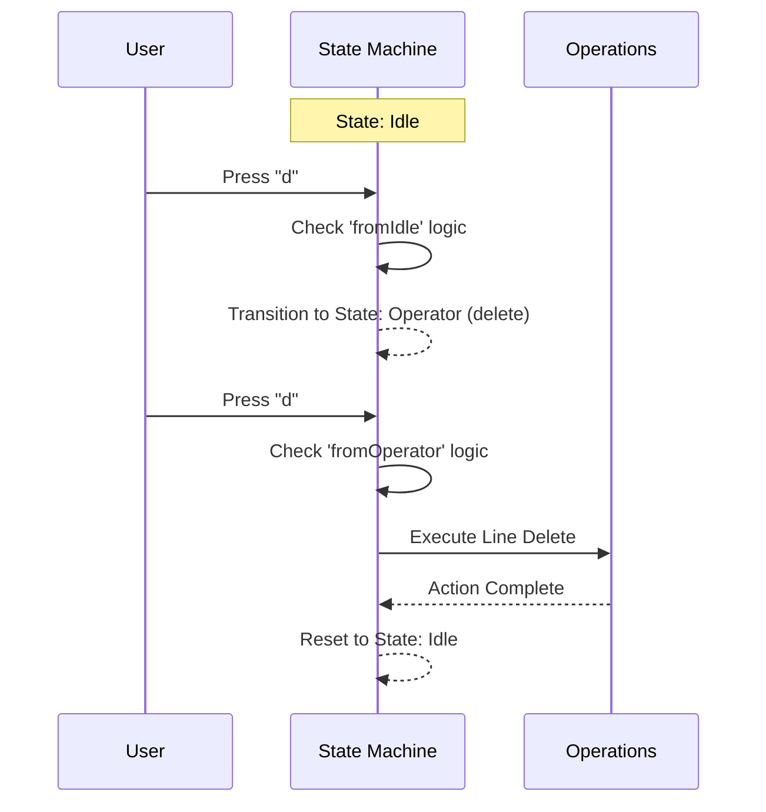

# Chapter 1: Vim State Machine

Welcome to the heart of the editor! If you have ever wondered why Vim feels so different from editors like Notepad or VS Code, the answer lies in its **State Machine**.

## The Problem: What does "d" mean?

In a standard text editor, if you press the `d` key, the letter "d" appears on the screen. Simple, right?

In Vim, pressing `d` might:
1.  **Type "d"** (if you are in Insert mode).
2.  **Start a delete operation** (if you are in Normal mode).
3.  **Finish a delete line operation** (if you just pressed `d` previously).

To manage this complexity, Vim uses a "State Machine." It doesn't just listen to *what* you type; it interprets it based on *where* you are in the machine's logic.

## The Analogy: A Manual Transmission Car

Think of Vim like a car with a manual gearbox:

*   **Insert Mode** is like "Drive." You press keys, and the car moves forward (text appears).
*   **Normal Mode (Idle)** is like "Neutral." You can look around, but pressing the gas (typing keys) triggers commands instead of moving text.
*   **Operator State** is like "Shifting Gears." You can't go from Neutral directly to 5th gear. You must shift. Similarly, you can't delete a word without entering the "Operator" state first.

**The Use Case: Deleting a Line (`dd`)**
Let's look at the classic Vim command `dd` (delete line). To the computer, this isn't one command. It is a journey through states:
1.  **Idle**: Waiting for input.
2.  **Operator**: You pressed `d`. Vim creates a "pending" state. It knows you want to delete *something*, but it doesn't know *what* yet.
3.  **Execute**: You pressed `d` again. Now Vim knows you mean "current line." It deletes the line and returns to Idle.

## Key Concepts

Let's look at how we define this in code. We use TypeScript types to strictly define exactly which "gear" the editor is in.

### 1. The Mode
At the highest level, Vim is either inserting text or processing commands.

```typescript
// From types.ts
export type VimState =
  // Type text directly
  | { mode: 'INSERT'; insertedText: string }
  // Interpret keys as commands
  | { mode: 'NORMAL'; command: CommandState }
```

When you are in `NORMAL` mode, the `command` property holds the specific state of the state machine.

### 2. The Command States
This is the gearbox. These are the valid states the editor can be in while in Normal mode.

```typescript
// From types.ts - Simplified
export type CommandState =
  | { type: 'idle' }              // Waiting for input
  | { type: 'count' }             // "10..." (waiting for motion)
  | { type: 'operator' }          // "d..." (waiting for motion)
  | { type: 'replace' }           // "r..." (waiting for char)
  // ... and others
```

If the state is `idle`, typing `d` moves us to `operator`. If the state is `operator`, typing `d` executes the deletion.

## Internal Implementation

How does the "brain" actually work? We use a central function called `transition`. It takes the **Current State** and the **User Input**, and returns the **Next State** (or an action to perform).

### Visualizing the Flow (`dd`)

Here is what happens inside the engine when you type `dd`.



### The Transition Logic

The core logic lives in `transitions.ts`. It acts like a traffic controller. It looks at the current state type and routes the input to the correct handler.

```typescript
// From transitions.ts
export function transition(
  state: CommandState,
  input: string,
  ctx: TransitionContext,
): TransitionResult {
  switch (state.type) {
    case 'idle':
      return fromIdle(input, ctx) // Handle input while idling
    case 'operator':
      return fromOperator(state, input, ctx) // Handle input while waiting for motion
    // ... cases for other states
  }
}
```

### 1. Starting from Idle
When you first press `d`, we call `fromIdle`. It recognizes `d` is an "operator" key.

```typescript
// From transitions.ts
function fromIdle(input: string, ctx: TransitionContext): TransitionResult {
  // If user types 'd', 'c', or 'y'
  if (isOperatorKey(input)) {
    // Switch state to 'operator'
    // We remember WHICH operator (e.g., 'delete')
    return { next: { type: 'operator', op: OPERATORS[input], count: 1 } }
  }
  // ... handle other keys like motions (h, j, k, l)
  return {}
}
```

### 2. Handling the Operator
Now the state is `operator`. The user presses `d` again. We call `fromOperator`.

```typescript
// From transitions.ts
function fromOperator(
  state: { type: 'operator'; op: Operator; count: number },
  input: string,
  ctx: TransitionContext,
): TransitionResult {
  // If the input matches the operator (e.g., 'd' matches 'd')
  // This means a linewise operation (dd, cc, yy)
  if (input === state.op[0]) {
    // Execute the action!
    return { execute: () => executeLineOp(state.op, state.count, ctx) }
  }
  
  // Otherwise, look for a motion (like 'w' for delete word)
  // ... logic continues
  return { next: { type: 'idle' } }
}
```

## Summary

The Vim State Machine is the foundation of the editor's power. By breaking actions into small states (`idle`, `operator`, `count`), Vim allows you to compose complex commands like "delete 3 words" (`d3w`) using simple, reusable building blocks.

We have barely scratched the surface of how the machine decides *which* state to go to next.

In the next chapter, we will look at the specific rules for moving between these states.

[Input Transition Logic](02_input_transition_logic.md)

---

Generated by [Code IQ](https://github.com/adityasoni99/Code-IQ)