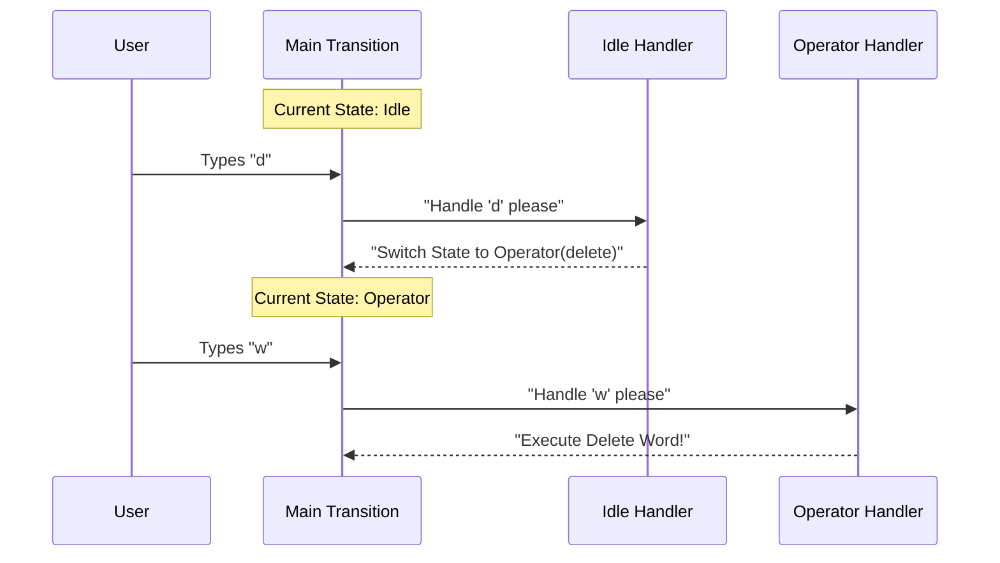

# Chapter 2: Input Transition Logic

In the previous chapter, [Vim State Machine](01_vim_state_machine.md), we learned that Vim acts like a car with a manual transmission. It has different "gears" (states) like `Idle` and `Operator`.

But who shifts the gears? Who decides that pressing `d` should shift from "Neutral" to "Delete Mode"?

That is the job of the **Input Transition Logic**.

## The Central Switchboard

Imagine a massive telephone switchboard from the 1920s. Operators sit there, waiting for a light to blink. When a call comes in (a keystroke), they check who is calling (the current state) and plug the wire into the correct destination (the handler).

In our Vim engine, the `transition` function is that operator.

### The Problem it Solves

Without this logic, the editor is just a dumb typewriter. We need a system that can look at the letter `d` and ask context-aware questions:

1.  **Are we Idle?** If yes, `d` means "Prepare to delete."
2.  **Are we already waiting to delete?** If yes, `d` means "Delete the current line."
3.  **Are we waiting for a text object?** If yes, `d` is invalid (you can't "delete inside d").

## The Architecture

The logic is built around one main function that acts as a router. It looks at the **Current State** and routes the **Input** to a specific helper function.

### The Main Router

Here is the simplified code for the main `transition` function found in `transitions.ts`.

```typescript
// From transitions.ts
export function transition(
  state: CommandState, // Where we are now
  input: string,       // What user typed
  ctx: Context,        // Editor data
): TransitionResult {
  switch (state.type) {
    case 'idle':
      return fromIdle(input, ctx)
    case 'operator':
      return fromOperator(state, input, ctx)
    // ... other states like 'replace', 'count'
  }
}
```

This function is short and sweet. It doesn't know *how* to handle the input; it just knows *who* should handle it.

## Use Case: The Journey of `dw`

Let's walk through the command `dw` (Delete Word). This command requires two steps handled by our transition logic.

### Step 1: From Idle to Operator

1.  **State:** `idle`
2.  **Input:** `d`

The router calls `fromIdle`. This function checks if `d` is a movement (like `j`) or an operator.

```typescript
// Inside fromIdle()
function fromIdle(input: string, ctx: Context) {
  // Check if input is an operator (d, c, y)
  if (isOperatorKey(input)) {
    // Return the NEW state
    return {
      next: { type: 'operator', op: 'delete', count: 1 }
    }
  }
  // ... handle other keys
}
```

**Result:** The editor acts like a traffic cop directing traffic. It says, "Switch state to `operator`." It does *not* delete anything yet.

### Step 2: From Operator to Execution

Now the state has changed.

1.  **State:** `operator` (waiting for motion)
2.  **Input:** `w` (word)

The router sees `state.type` is `operator`, so it calls `fromOperator`.

```typescript
// Inside fromOperator()
function fromOperator(state, input, ctx) {
  // If input is a motion (like 'w', 'j', '$')
  if (isMotion(input)) {
    return {
      // We have both an Operator (delete) and a Motion (word)
      // We are ready to execute!
      execute: () => executeOperatorMotion(state.op, input, ctx)
    }
  }
}
```

**Result:** The logic sees we have a complete sentence ("Delete" + "Word"). It bundles them up and sends an `execute` command.

## Visualizing the Flow

Here is how the transition logic routes the traffic for `dw`.



## Internal Implementation

Let's look at a few specific scenarios in the code to see how it handles edge cases.

### 1. Handling "Doubling" (`dd`)

When you are in the `operator` state (having pressed `d` once), pressing `d` again means "Delete Line." The `fromOperator` function checks for this specifically.

```typescript
// Inside transitions.ts -> fromOperator
function fromOperator(state, input, ctx) {
  // If the input matches the pending operator (d == d)
  if (input === state.op[0]) {
    // Execute line operation immediately
    return { execute: () => executeLineOp(state.op, state.count, ctx) }
  }
  // ... check for motions
}
```

### 2. Handling Counts (`2d`)

What if you type a number? Numbers are transitions too!

If you are `idle` and type `2`, you aren't moving or deleting. You are building a number.

```typescript
// Inside transitions.ts -> fromIdle
function fromIdle(input, ctx) {
  // If input is 1-9
  if (/[1-9]/.test(input)) {
    // Switch to 'count' state to collect more digits
    return { next: { type: 'count', digits: input } }
  }
  // ...
}
```

This moves the editor into a `count` state, waiting for the rest of the command (e.g., `2d` -> delete 2 lines).

## Why This Matters

By separating **State** from **Input**, we make the code modular.

*   If we want to add a new motion (e.g., jump to next paragraph), we only update the motion logic. We don't have to rewrite the "Delete" logic.
*   If we want to add a new operator (e.g., "Uppercase" operator), it automatically works with all existing motions.

This is why Vim is so composable. The Transition Logic ensures that any **Operator** can be combined with any **Motion**.

## Summary

The **Input Transition Logic** is the traffic controller.
1.  It receives the User Input.
2.  It checks the State Machine.
3.  It delegates to a specific handler (`fromIdle`, `fromOperator`).
4.  It returns the Next State or an Action.

However, once the controller decides *what* to do (e.g., "Delete a Word"), we hit a new problem. What exactly *is* a "Word"? How does the editor know where the word ends?

To answer that, we need to understand Motions.

[Next Chapter: Motion Resolution](03_motion_resolution.md)

---

Generated by [Code IQ](https://github.com/adityasoni99/Code-IQ)