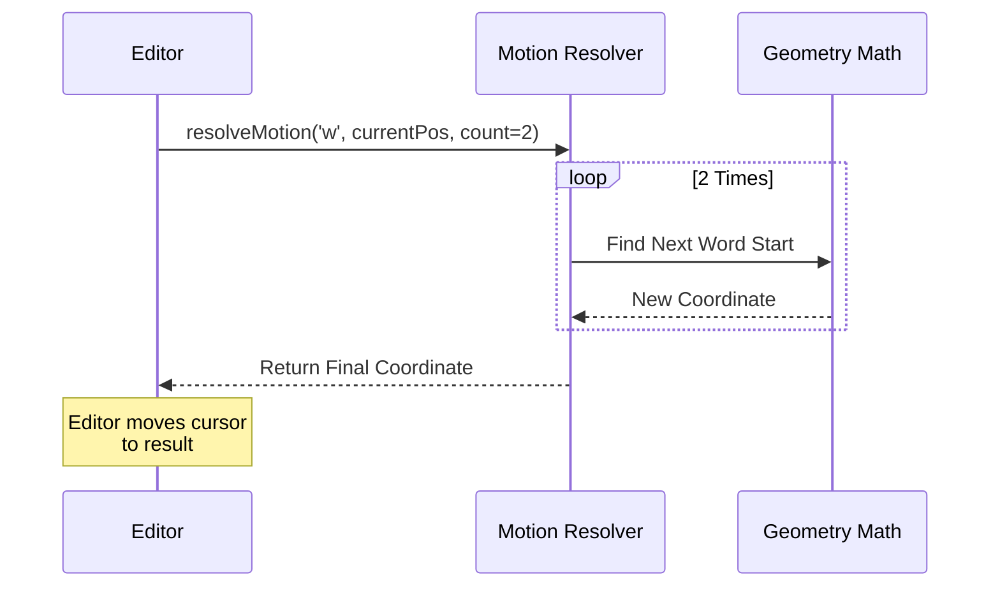

# Chapter 3: Motion Resolution

In the previous chapter, [Input Transition Logic](02_input_transition_logic.md), we looked at how Vim acts like a switchboard operator. It receives a key (like `w`) and decides *what* to do (e.g., "Execute a motion").

But knowing *that* we need to move to the next word is different from knowing *where* the next word actually is.

This brings us to **Motion Resolution**.

## The Problem: "Where is the destination?"

Imagine you are driving a car.
*   **The Driver (Transition Logic):** Decides to turn left.
*   **The GPS (Motion Resolution):** Calculates the coordinates of the destination.

In Vim, motions (like `w`, `b`, `$`, `j`) are used in two very different ways:
1.  **Movement:** Just moving the cursor (e.g., press `w`).
2.  **Operators:** Modifying text from point A to point B (e.g., `dw` deletes from cursor to the next word).

We don't want to write the logic for "find the next word" twice. We need a shared system that simply calculates coordinates without changing anything.

## The Solution: Pure Geometry

**Motion Resolution** is a layer of "pure" functions. It takes your current location and a command, and it returns your new location. It does **not** update the screen or delete text. It just does the math.

### Use Case: The `w` Command

Let's look at the classic "next word" motion (`w`).

**Scenario:**
*   Text: `Hello World`
*   Cursor: On `H` (Line 0, Column 0)
*   Command: `w`

** The Motion Resolver's Job:**
It looks at the text and calculates: "If I move to the next word start, I will land on 'W' (Line 0, Column 6)."

It returns: `{ line: 0, col: 6 }`.

## Key Concepts

To implement this, we rely on three simple concepts.

### 1. The Cursor Object
We don't manipulate raw text directly here. We manipulate a `Cursor` object that knows how to navigate the text grid.

```typescript
// Conceptual Cursor
interface Cursor {
  line: number // Which row?
  col: number  // Which column?
  
  // Helper methods
  right(): Cursor
  nextVimWord(): Cursor
}
```

### 2. The Resolver Function
This is the main entry point. It takes the **Current Cursor** and the **Key**, and returns the **New Cursor**.

```typescript
// From motions.ts
export function resolveMotion(
  key: string,
  cursor: Cursor,
  count: number,
): Cursor {
  let result = cursor
  // If count is 3 (e.g., '3w'), do it 3 times
  for (let i = 0; i < count; i++) {
    result = applySingleMotion(key, result)
  }
  return result
}
```

### 3. The Mapping Logic
We need a list of rules that maps keys to cursor movements.

```typescript
// From motions.ts
function applySingleMotion(key: string, cursor: Cursor): Cursor {
  switch (key) {
    case 'h': return cursor.left()
    case 'l': return cursor.right()
    case 'w': return cursor.nextVimWord() // The heavy lifting
    case '$': return cursor.endOfLogicalLine()
    default:  return cursor
  }
}
```

This switch statement is the dictionary of our GPS. It defines what every key means in terms of geometry.

## Motion Nuances: Inclusive vs. Exclusive

Not all motions are created equal. When you delete a word (`dw`), the character under the cursor at the *destination* is usually NOT deleted. This is called **Exclusive**.

However, if you delete to the end of the line (`d$`), the last character IS deleted. This is called **Inclusive**.

Our Motion Resolution layer defines these rules:

```typescript
// From motions.ts
export function isInclusiveMotion(key: string): boolean {
  // 'e' (end of word) and '$' (end of line) are inclusive
  return 'eE$'.includes(key)
}
```

This helper allows the Operator (which we will build in the next chapter) to know exactly how much text to cut.

## Internal Implementation

Let's visualize the flow when the user types `2w` (Move 2 words forward).

### The Flow



### The Code

The implementation in `motions.ts` is designed to be stateless. It doesn't care about the mode you are in; it only cares about geometry.

Here is the core function again with annotations:

```typescript
// From motions.ts
export function resolveMotion(key: string, cursor: Cursor, count: number): Cursor {
  let result = cursor
  
  // Loop handles counts (like '5j' or '2w')
  for (let i = 0; i < count; i++) {
    const next = applySingleMotion(key, result)
    
    // Safety check: If we hit a wall (EOF), stop trying
    if (next.equals(result)) break
    
    result = next
  }
  return result
}
```

### Why is this separated?

You might wonder, "Why not just put this code inside the Delete command?"

Imagine we want to add a new command: **Yank** (copy).
*   If we wrote the logic inside Delete, we'd have to copy-paste it to Yank.
*   By separating **Motion Resolution**, both `dw` (Delete Word) and `yw` (Yank Word) call the exact same `resolveMotion` function.

They both ask the GPS: "Where is the end of the word?"
*   Delete says: "Okay, remove everything until there."
*   Yank says: "Okay, copy everything until there."

## Summary

**Motion Resolution** is the geometric brain of Vim.
1.  It is a **Pure Function**: Input (Start) -> Output (Destination).
2.  It handles **Counts**: `3w` calculates the "next word" 3 times.
3.  It defines **Inclusivity**: Whether the target character is included in the range.

Now we have a State Machine (Chapter 1), a Switchboard (Chapter 2), and a GPS (Chapter 3).

We have all the pieces needed to actually change the text. It's time to build the **Operator**.

[Next Chapter: Operator Execution](04_operator_execution.md)

---

Generated by [Code IQ](https://github.com/adityasoni99/Code-IQ)