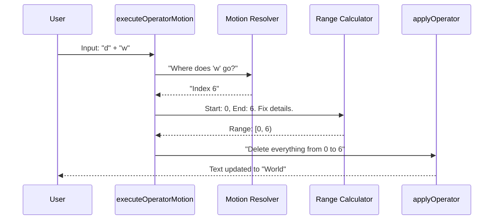

# Chapter 4: Operator Execution

In the previous chapter, [Motion Resolution](03_motion_resolution.md), we built the "GPS" for our editor. We learned how to calculate where the cursor *should* go (e.g., "End of the word").

However, calculating a destination doesn't change the text. It just gives us coordinates.

Now, we need to actually do the work. We need to take those coordinates and apply a transformation: **Delete**, **Change**, or **Copy (Yank)**.

## The Motivation: The Construction Crew

Imagine a road construction project.

1.  **The Surveyor (Motion):** Walks out, measures 10 feet, and plants a flag. They don't dig; they just mark the range.
2.  **The Construction Crew (Operator):** Looks at the starting point (User) and the flag (Surveyor). They perform the heavy lifting within that area.

In Vim, this separation is powerful.
*   If you have a **"Delete"** crew (Operator), they can work with *any* Surveyor (Motion).
*   `dw` (Delete Word), `d$` (Delete to end of line), `dgg` (Delete to start of file).

The logic for "Deleting" is written once. The logic for "Finding the end of the word" is written once. They combine to form a command.

## Key Concepts

To understand how we implement this in `operators.ts`, we need to define three things.

### 1. The Operator (The Verb)
This is the action. It defines *what* we are doing to the text.
*   `d`: Delete (Remove text)
*   `c`: Change (Remove text + Enter Insert Mode)
*   `y`: Yank (Copy text to clipboard)

### 2. The Range (The Area)
An operator needs a **Start Point** and an **End Point**.
*   **Start:** Where your cursor is right now.
*   **End:** Calculated by the Motion (from Chapter 3).

### 3. The Context (The World)
Because we are finally changing the text, we need full access to the editor's data. We bundle this into an object called `OperatorContext`.

```typescript
export type OperatorContext = {
  cursor: Cursor        // Where are we?
  text: string          // The document content
  setText: (t: string) => void // Function to update text
  // ... helper functions for registers/clipboard
}
```

## Use Case: Deleting a Word (`dw`)

Let's look at the flow for the command `dw`.

*   **Current Text:** `Hello World`
*   **Cursor:** Index 0 ('H')
*   **Input:** `d` (Operator) + `w` (Motion)

### Step 1: The Orchestrator

When the State Machine (Chapter 2) detects a complete Operator+Motion command, it calls `executeOperatorMotion`.

This function is the manager. It coordinates the Surveyor and the Crew.

```typescript
// From operators.ts (Simplified)
export function executeOperatorMotion(
  op: Operator,       // 'delete'
  motion: string,     // 'w'
  count: number,      // 1
  ctx: OperatorContext 
): void {
  // 1. Ask the Motion Resolver (The Surveyor) for the target
  const target = resolveMotion(motion, ctx.cursor, count)

  // 2. Calculate the exact start and end points
  const range = getOperatorRange(ctx.cursor, target, motion, op, count)

  // 3. Perform the actual work (The Crew)
  applyOperator(op, range.from, range.to, ctx, range.linewise)
}
```

### Step 2: Calculating the Range

You might think the range is just `[Cursor, Target]`. Usually, yes. But there are edge cases:

1.  **Backwards Motions:** If you press `db` (delete back), the Target is *before* the Cursor. We need to swap them so `from` is always smaller than `to`.
2.  **Inclusivity:** If you use `e` (end of word), the last character should be included. If you use `w` (start of next word), the destination character is *not* deleted.

We use a helper function to normalize this math.

```typescript
// From operators.ts
function getOperatorRange(cursor, target, motion, op, count) {
  // Ensure 'from' is always the lower number
  let from = Math.min(cursor.offset, target.offset)
  let to = Math.max(cursor.offset, target.offset)

  // Adjust for inclusive motions (like '$' or 'e')
  if (isInclusiveMotion(motion)) {
    to = cursor.measuredText.nextOffset(to)
  }
  
  return { from, to }
}
```

### Step 3: Applying the Operator

Now we have clean coordinates: `from: 0`, `to: 6`. We simply slice the string.

```typescript
// From operators.ts
function applyOperator(op, from, to, ctx) {
  // 1. Slice the string to remove the range
  if (op === 'delete') {
    const newText = ctx.text.slice(0, from) + ctx.text.slice(to)
    
    // Update the editor state
    ctx.setText(newText)
    ctx.setOffset(from) // Move cursor to the cut point
  }
  
  // 2. Handle 'change' and 'yank' similarly...
}
```

## Visualizing the Execution

Here is the complete lifecycle of a `dw` command.



## Internal Implementation: Special Cases

While `dw` is standard, Vim has other types of executions that behave differently.

### Linewise Operations (`dd`)

When you type `dd`, you aren't moving a cursor. You are selecting a whole line. The logic here is slightly different because it ignores specific character columns and looks for newline characters (`\n`).

```typescript
// From operators.ts
export function executeLineOp(op: Operator, count: number, ctx: OperatorContext) {
  // Find where the current line starts
  const lineStart = ctx.cursor.startOfLogicalLine().offset
  
  // Find where the next line starts
  let lineEnd = lineStart
  // ... loop to find the next \n character ...

  // Apply the operator to that whole chunk
  applyOperator(op, lineStart, lineEnd, ctx, true)
}
```

### Visualizing Linewise Logic

If you have:
```text
Line 1
Line 2
Line 3
```
And cursor is on "Line 2":
1.  `lineStart` finds the newline after "Line 1".
2.  `lineEnd` finds the newline after "Line 2".
3.  `applyOperator` snips that entire section out.

## Summary

**Operator Execution** is where the magic happens. It combines the geometric calculations of **Motions** (Chapter 3) with text transformations.

*   **Motions** tell us "Where".
*   **Operators** tell us "What".
*   **Execution** Logic brings them together to modify the document.

So far, we have covered motions like `w` (word) and `j` (down). But what if you want to "Delete inside parentheses" (`di)`)? `i)` isn't a movement; you can't type `i)` to move your cursor there.

These are called **Text Objects**, and they require a special kind of range calculation.

[Next Chapter: Text Objects](05_text_objects.md)

---

Generated by [Code IQ](https://github.com/adityasoni99/Code-IQ)