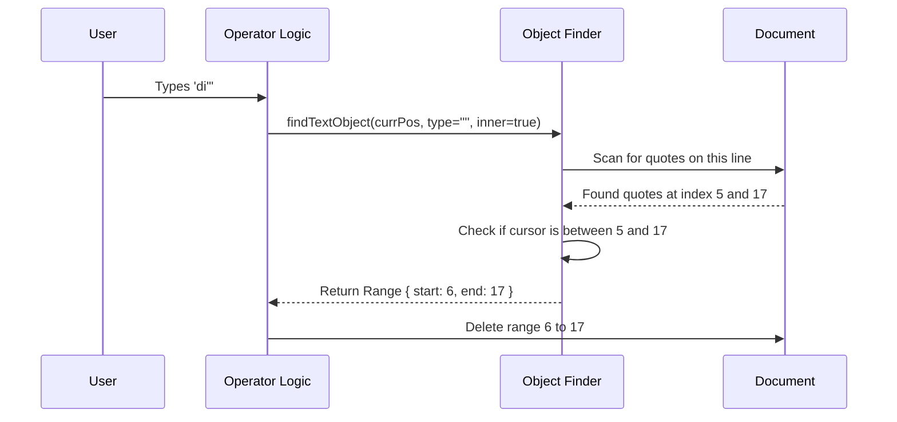

# Chapter 5: Text Objects

In the previous chapter, [Operator Execution](04_operator_execution.md), we learned how to combine an **Operator** (like Delete) with a **Motion** (like "move to next word").

This works great if you are at the *start* of the word. But what if you are in the middle?

## The Problem: Dumb Ranges vs. Smart Objects

Imagine you have this code, and your cursor is on the letter `r` in "Error":

```javascript
console.log("Error Message");
              ^ Cursor is here
```

If you type `dw` (Delete Word), Vim calculates the range from the cursor (`r`) to the next word start (`M`).
**Result:** `console.log("E Message");`

This is rarely what you want. You usually want to delete the *whole* string "Error Message".

## The Solution: The "Magic Wand"

Standard Motions (`w`, `j`, `$`) are like drawing a line with a ruler. They go from Point A to Point B.

**Text Objects** are like the "Magic Wand" tool in Photoshop. You click inside an object, and the software automatically figures out the boundaries based on context.

Instead of saying "Delete from here to the end," you say:
*   `di"`: Delete **Inside** **Quotes**.
*   `daw`: Delete **Around** **Word**.
*   `ci(`: Change **Inside** **Parentheses**.

## Key Concepts

To implement this, we stop thinking about "movement" and start thinking about "boundaries."

### 1. Inner (i) vs. Around (a)
Every text object comes in two flavors. Think of a text object like an orange.

*   **Inner (`i`):** The fruit inside. You get the content, but not the container (delimiters or surrounding space).
*   **Around (`a`):** The fruit plus the peel. You get the content *and* the container.

**Example: `( hello )`**
*   `di(` deletes `hello`. Result: `(  )`
*   `da(` deletes `( hello )`. Result: ``

### 2. The Search Strategy
Unlike a motion, which usually just goes forward, a Text Object must look in **both directions**.

If you type `di"` (delete inside quotes), the engine must:
1.  Scan **Backwards** to find the opening quote.
2.  Scan **Forwards** to find the closing quote.
3.  Return the range between them.

## Use Case: Delete Inside Quotes (`di"`)

Let's solve the specific problem of deleting a string literal.

**Scenario:**
*   Text: `var x = "hello world";`
*   Cursor: On 'w' in "world".
*   Command: `di"`

**The Goal:**
We need a function that returns the start and end indices of the text *between* the quotes, ignoring the quotes themselves.

## Internal Implementation

How does the engine actually find these boundaries? It uses a dedicated module: `textObjects.ts`.

### Visualizing the Algorithm

Here is what happens when you trigger a text object command.



### The Code Structure

The logic lives in `textObjects.ts`. It acts as a specialized resolver.

#### 1. Defining the Delimiters
First, we tell the engine what pairs exist.

```typescript
// From textObjects.ts
const PAIRS = {
  '(': ['(', ')'],
  '{': ['{', '}'],
  '"': ['"', '"'],
  // ... others
}
```

#### 2. The Entry Point
When the Operator calls for a text object, we check the type and dispatch the correct searcher.

```typescript
// From textObjects.ts
export function findTextObject(text, offset, type, isInner) {
  // If looking for words (w or W)
  if (type === 'w') return findWordObject(text, offset, isInner)

  // If looking for pairs (", (, {)
  const pair = PAIRS[type]
  if (pair) {
    const [open, close] = pair
    // Logic differs if opening and closing chars are identical (like quotes)
    if (open === close) return findQuoteObject(text, offset, open, isInner)
    return findBracketObject(text, offset, open, close, isInner)
  }
  return null
}
```

### Deep Dive: Finding Quotes

Finding quotes is tricky because they don't have distinct "open" and "close" characters. We have to find *all* quotes on the line and see where the cursor falls.

Here is a simplified version of `findQuoteObject`:

```typescript
// Simplified from textObjects.ts
function findQuoteObject(text, offset, quote, isInner) {
  // 1. Get the current line boundaries
  const lineStart = text.lastIndexOf('\n', offset - 1) + 1
  const lineEnd = text.indexOf('\n', offset)
  const line = text.slice(lineStart, lineEnd)

  // 2. Find ALL quote positions in this line
  const positions = []
  for (let i = 0; i < line.length; i++) {
    if (line[i] === quote) positions.push(i)
  }

  // ... (continued below)
```

Once we have the positions (e.g., indices `[5, 17, 25, 30]`), we assume they come in pairs: (5-17) is a string, (25-30) is a string.

```typescript
  // 3. Find which pair surrounds our cursor
  const relativeCursor = offset - lineStart
  
  // Check pairs: 0-1, 2-3, etc.
  for (let i = 0; i < positions.length - 1; i += 2) {
    const start = positions[i]
    const end = positions[i+1]

    if (start <= relativeCursor && relativeCursor <= end) {
      // Found it! Return absolute coordinates.
      // If 'inner', skip the quotes themselves (+1)
      return isInner 
        ? { start: lineStart + start + 1, end: lineStart + end }
        : { start: lineStart + start, end: lineStart + end + 1 }
    }
  }
  return null
}
```

### Deep Dive: Finding Words (`iw`)

Finding a "word" is different. It relies on character classification (is this a letter or a symbol?).

1.  **Identify the type:** Look at the character under the cursor. Is it a word character (a-z) or punctuation?
2.  **Scan Left:** Keep moving left until the character type changes.
3.  **Scan Right:** Keep moving right until the character type changes.

```typescript
// Simplified Concept from textObjects.ts
function findWordObject(text, offset, isInner) {
  // 1. Expand left
  let start = offset
  while (isWordChar(text[start - 1])) start--

  // 2. Expand right
  let end = offset
  while (isWordChar(text[end])) end++

  // 3. Handle whitespace for 'around' (aw)
  if (!isInner) {
    while (isWhitespace(text[end])) end++
  }

  return { start, end }
}
```

## Integration with Operators

Now that we have `textObjects.ts` calculating ranges, we simply plug it into our operator execution.

Recall `executeOperatorTextObj` from the previous chapter?

```typescript
// From operators.ts
export function executeOperatorTextObj(op, scope, objType, count, ctx) {
  // 1. Ask the specialist to find the boundaries
  const range = findTextObject(ctx.text, ctx.cursor.offset, objType, scope === 'inner')
  
  // 2. If nothing found (e.g., no quotes), do nothing
  if (!range) return

  // 3. Apply the operator (Delete/Change/Yank) to that range
  applyOperator(op, range.start, range.end, ctx)
}
```

This is the beauty of the system. The **Operator** doesn't know how to find a quote. The **Text Object Finder** doesn't know how to delete text. They communicate via simple Start/End coordinates.

## Summary

Text Objects represent a leap in editing efficiency. They allow you to tell the editor *what* you want to modify based on the structure of your code, rather than counting characters or lines.

*   **Motions** are for navigation (`w`, `j`).
*   **Text Objects** are for selection (`iw`, `i"`).
*   **Scopes** define the boundary (`inner` vs `around`).

At this point, we have a fully functional editor! We can type, move, delete lines, and manipulate complex objects.

However, complex commands often need to store data or repeat actions. To handle things like "Repeat last command" (`.`) or "Paste from clipboard" (`p`), we need a place to store global state.

[Next Chapter: Operator Context](06_operator_context.md)

---

Generated by [Code IQ](https://github.com/adityasoni99/Code-IQ)