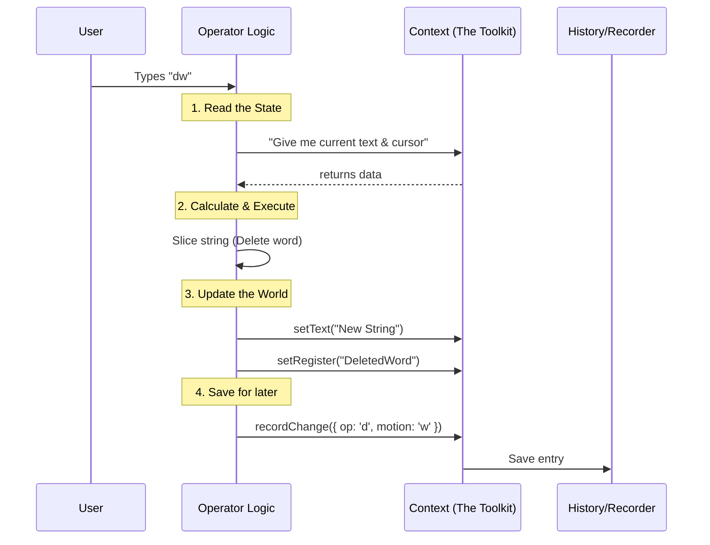

# Chapter 6: Operator Context

In the previous chapter, [Text Objects](05_text_objects.md), we learned how to select complex chunks of text, like "inside quotes."

We now have all the logic pieces:
1.  **State Machine:** Knows we are deleting.
2.  **Motions:** Knows where the text starts and ends.
3.  **Operators:** Knows how to slice the string.

But here is a question: **Where is the text actually stored?** And when we copy text with `y` (yank), where does it go?

This brings us to the final piece of the puzzle: the **Operator Context**.

## The Motivation: The Chef and The Kitchen

Think of the Vim engine like a professional Chef.
*   The **Chef** (The Code) knows all the recipes. They know exactly how to slice an onion (Operator) or find a specific ingredient (Motion).
*   However, a Chef cannot cook in empty space. They need a **Kitchen**.

The **Operator Context** is that Kitchen. It is a toolbox passed to every function that contains:
1.  ** The Ingredients:** The current document text.
2.  ** The Countertop:** The current cursor position.
3.  ** The Fridge:** The clipboard (registers) to store food.
4.  ** The Receipt:** A log of what was just cooked (for undo/redo).

Without the Context, our functions are just abstract math. With Context, they can change the world.

## Key Concepts

The Context serves as a bridge between our "Pure Logic" and the "Real World."

### 1. The State Interface
In programming, we try to keep logic "pure" (input -> output). But an editor is inherently "dirty" (it holds state). The Context object wraps this state safely.

```typescript
// Conceptual View
type Context = {
  text: string          // The document
  cursor: Cursor        // Your location
  setText(t: string)    // Way to change document
  setOffset(n: number)  // Way to move cursor
}
```

### 2. The Registers (Clipboard)
When you delete a word (`dw`) or yank a line (`yy`), that text doesn't disappear. It goes into a "Register." The Context holds these registers so you can paste (`p`) later.

### 3. The Recorder (Dot Repeat)
One of Vim's most famous features is the `.` command, which repeats the last change. How does it know what you did? The Context has a `recordChange` method that acts like a flight recorder (black box).

## Use Case: The "Dot" Command (`.`)

Let's see why Context is vital for the command `.` (Repeat).

**Scenario:**
1.  You type `dw` (Delete Word).
2.  You move the cursor to another word.
3.  You type `.`.

**What happens inside:**
1.  **During `dw`:** The Operator executes, but it *also* tells the Context: *"Record that I just did a Delete operation with the Word motion."*
2.  **During `.`:** The engine asks the Context: *"What was the last thing recorded?"* The Context replies, and the engine replays it.

## Internal Implementation

Let's visualize how the data flows when you execute a command.

### The Flow



### The Code

The Context is defined in `operators.ts`. It is a TypeScript type that lists everything an operator is allowed to touch.

#### 1. Defining the Toolbox
This is the interface passed to every operator function.

```typescript
// From operators.ts
export type OperatorContext = {
  cursor: Cursor
  text: string
  
  // The 'Write' methods
  setText: (text: string) => void
  setOffset: (offset: number) => void
  
  // The 'Extras'
  setRegister: (content: string, linewise: boolean) => void
  recordChange: (change: RecordedChange) => void
}
```

#### 2. Using the Toolbox (Deleting)
When we run `dw`, we use the Context to interact with the editor.

```typescript
// From operators.ts - applyOperator
function applyOperator(op, from, to, ctx: OperatorContext) {
  // 1. READ from ctx.text
  const deletedChunk = ctx.text.slice(from, to)
  
  // 2. WRITE to Register (Clipboard)
  ctx.setRegister(deletedChunk, false)

  if (op === 'delete') {
    // 3. CALCULATE new text
    const newText = ctx.text.slice(0, from) + ctx.text.slice(to)
    
    // 4. WRITE updates back to Context
    ctx.setText(newText)
    ctx.setOffset(from)
  }
}
```

#### 3. Recording the History
Finally, at the end of `executeOperatorMotion`, we leave a paper trail.

```typescript
// From operators.ts
export function executeOperatorMotion(op, motion, count, ctx) {
  // ... calculate ranges ...
  // ... applyOperator ...

  // RECORD what just happened
  ctx.recordChange({ 
    type: 'operator', 
    op: op, 
    motion: motion, 
    count: count 
  })
}
```

This `recordChange` function is what allows the `.` command (handled in [Input Transition Logic](02_input_transition_logic.md)) to work later.

## Why is this "Beginner Friendly"?

You might wonder why we pass this object around instead of just having a global variable called `THE_EDITOR`.

1.  **Testing:** We can create a "Fake Context" for testing. We can give the function a fake document, run `dw`, and check if the fake document changed. We don't need to run the whole app to test one button.
2.  **Safety:** The Operator function can *only* do what the Context allows. It cannot accidentally close the window or change the font size, because `setFontSize` isn't in the `OperatorContext`.

## Summary

The **Operator Context** is the glue that holds the application together.

*   It stores the **Data** (Text, Cursor).
*   It provides the **Tools** (setText, setRegister).
*   It remembers the **Past** (recordChange).

**Congratulations!** You have completed the tour of the Vim Engine.

We started with a **State Machine** to understand inputs. We used **Motions** to navigate geometry. We built **Operators** to transform text, and we used **Context** to make those changes real.

You now understand the core architecture of how a modal editor like Vim "thinks."

### Complete Tutorial Navigation
1. [Vim State Machine](01_vim_state_machine.md)
2. [Input Transition Logic](02_input_transition_logic.md)
3. [Motion Resolution](03_motion_resolution.md)
4. [Operator Execution](04_operator_execution.md)
5. [Text Objects](05_text_objects.md)
6. **Operator Context** (You are here)

---

Generated by [Code IQ](https://github.com/adityasoni99/Code-IQ)