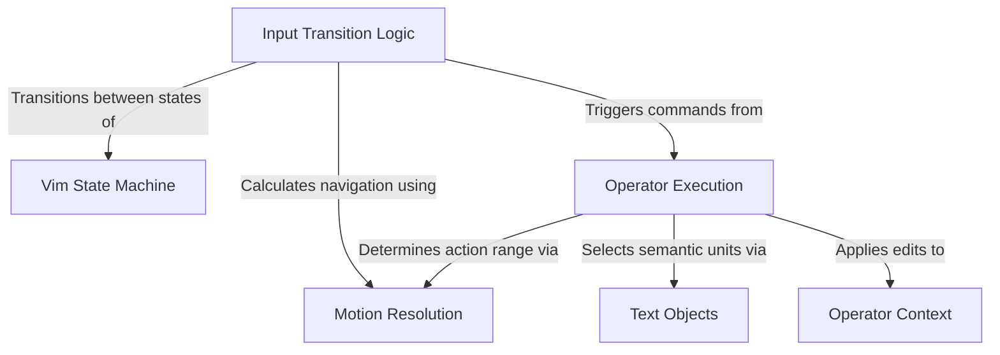

# Tutorial: vim

This project implements a robust **Vim emulation engine** that processes user keystrokes through a strict **state machine** rather than simple event handlers. It decouples the *intent* (transitions) from the *action* (operators) and the *geometry* (motions), allowing complex commands like "delete inner word" to be executed safely via a unified **context interface**.

## Chapters

1. [Vim State Machine](01_vim_state_machine.md)
2. [Input Transition Logic](02_input_transition_logic.md)
3. [Motion Resolution](03_motion_resolution.md)
4. [Operator Execution](04_operator_execution.md)
5. [Text Objects](05_text_objects.md)
6. [Operator Context](06_operator_context.md)

---

Generated by [Code IQ](https://github.com/adityasoni99/Code-IQ)