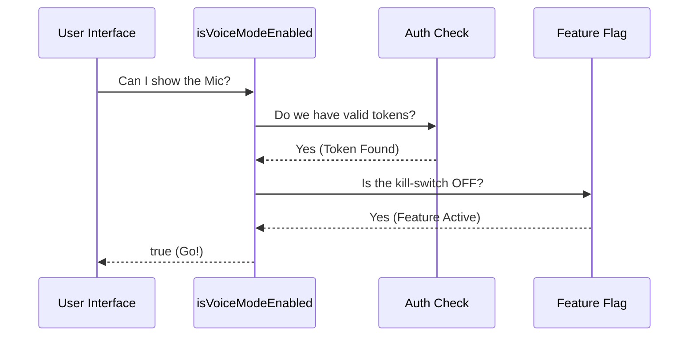

# Chapter 1: Composite Readiness Logic

Welcome to the Voice project! 

Building a robust application is a bit like being a pilot preparing for takeoff. Before a pilot pushes the throttle, they go through a **Pre-Flight Checklist**. They don't just ask "Is the engine on?"; they also ask "Do we have clearance from the tower?" and "Is the runway clear?"

In our application, we have a "Voice Mode" feature. However, we can't just let the user access it immediately. We need to check two distinct things:
1.  **Authentication:** Is the user actually logged in? (Do they have the keys?)
2.  **Configuration:** Is the feature actually enabled on our end? (Do they have clearance?)

This chapter introduces the **Composite Readiness Logic**: a single, simple way to ask, "Is everything ready to go?"

## The Problem

Imagine you are building the User Interface (UI). You need to decide whether to show the microphone button.

You *could* write code like this inside your button component:

```typescript
// ❌ Don't do this! It's messy and hard to read.
if (user.isLoggedIn && user.hasToken && remoteConfig.isVoiceOn && !system.isDown) {
  showMicrophone();
}
```

If you repeat this everywhere, your code becomes messy. If the rules change (e.g., we add a maintenance mode), you have to update every file.

## The Solution: A Single "Go/No-Go" Function

We solve this by creating a **Master Checklist** function called `isVoiceModeEnabled()`. 

This function acts as our pilot. It checks the keys (Auth) and the clearance (Remote Flags) and returns a simple `true` (Go) or `false` (No-Go).

### How to use it

As a developer building the UI, you don't need to worry about *how* the checks works. You just use the master function.

```typescript
import { isVoiceModeEnabled } from './voiceModeEnabled';

// ✅ Do this! Clean and simple.
if (isVoiceModeEnabled()) {
  console.log("Voice mode is ready! Rendering UI...");
  renderMicrophoneButton();
} else {
  console.log("Voice mode is unavailable.");
}
```

**What happens here:**
1.  **Input:** None (it checks the global state).
2.  **Output:** `true` only if **ALL** checks pass.
3.  **Result:** Your UI renders strictly when it is safe to do so.

---

## How it Works: Under the Hood

Let's peek inside the cockpit to see how `isVoiceModeEnabled` makes its decision. It performs a **Composite Check**, meaning it combines multiple independent checks.

### The Logic Flow

When you ask "Is voice enabled?", the system performs two parallel investigations:

1.  **The Auth Check:** It looks into the user's keychain to see if they have valid credentials for the AI provider (Anthropic).
2.  **The Safety Check:** It checks a "Feature Flag" (via a tool called GrowthBook) to see if we, the developers, have remotely killed the feature due to bugs or maintenance.

Here is the sequence of events:



---

## Deep Dive: The Code

Let's look at the actual implementation in `voiceModeEnabled.ts`.

### 1. The Master Function

This is the entry point. Notice how simple it is—it just combines two other functions using `&&` (AND). Both must be true.

```typescript
/**
 * Full runtime check: auth + GrowthBook kill-switch.
 */
export function isVoiceModeEnabled(): boolean {
  // We only return TRUE if we have Auth AND the Feature is enabled.
  return hasVoiceAuth() && isVoiceGrowthBookEnabled()
}
```

### 2. The Auth Check (The Keys)

This function checks if the user is legally allowed to speak. Specifically, it looks for an OAuth token. We will cover the details of how we get these tokens in [Provider-Specific Authentication](03_provider_specific_authentication.md).

```typescript
export function hasVoiceAuth(): boolean {
  // First, check if the provider is even set to one that supports voice.
  if (!isAnthropicAuthEnabled()) {
    return false
  }
  
  // Then, check if we actually have the access token (the key).
  const tokens = getClaudeAIOAuthTokens()
  return Boolean(tokens?.accessToken)
}
```

**Explanation:**
*   It checks `isAnthropicAuthEnabled()` to ensure we are using the correct provider.
*   It retrieves tokens using `getClaudeAIOAuthTokens()`.
*   It converts the result to a boolean: if the token exists, it returns `true`.

### 3. The Feature Flag Check (The Clearance)

This check allows us to control the feature remotely without releasing a new version of the app. We use a concept called a "Kill Switch." We will learn how to configure this in [Remote Feature Gating (GrowthBook)](02_remote_feature_gating__growthbook_.md).

```typescript
export function isVoiceGrowthBookEnabled(): boolean {
  // 1. Check if the feature acts as a "kill switch".
  // 'tengu_amber_quartz_disabled' is our emergency stop button.
  // If the remote value is true (disabled), we return false.
  return feature('VOICE_MODE')
    ? !getFeatureValue_CACHED_MAY_BE_STALE('tengu_amber_quartz_disabled', false)
    : false
}
```

**Explanation:**
*   It uses `feature('VOICE_MODE')` to check if the code was even compiled into the app. This is part of [Build-Time Code Elimination](05_build_time_code_elimination.md).
*   It checks a remote flag named `tengu_amber_quartz_disabled`.
*   **Logic:** If the "disabled" flag is `true`, the feature is *off*, so this function returns `false`.

## Conclusion

You have just learned the **Composite Readiness Logic**. Instead of scattering checks all over your application, you now have a single source of truth: `isVoiceModeEnabled()`.

This approach makes your code:
1.  **Safer:** You never accidentally enable a feature when the user isn't logged in.
2.  **Cleaner:** Your UI code focuses on UI, not complex logic.
3.  **Controllable:** You can turn off the feature remotely if something breaks.

In the next chapter, we will learn exactly how that remote switch works.

[Next Chapter: Remote Feature Gating (GrowthBook)](02_remote_feature_gating__growthbook_.md)

---

Generated by [Code IQ](https://github.com/adityasoni99/Code-IQ)