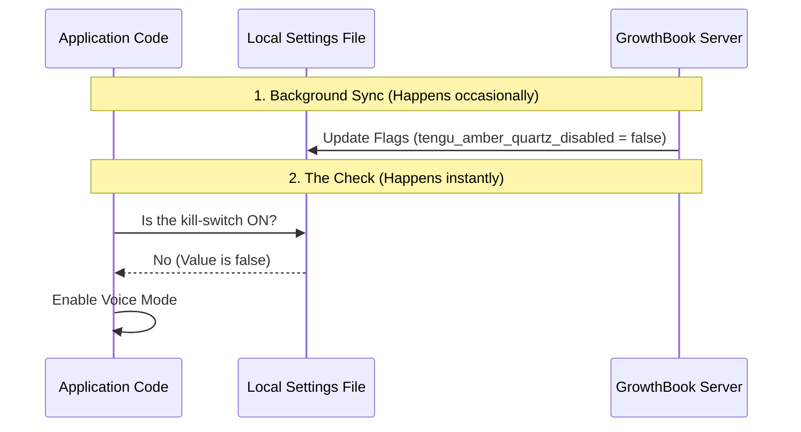

# Chapter 2: Remote Feature Gating (GrowthBook)

In the previous chapter, [Composite Readiness Logic](01_composite_readiness_logic.md), we built a "Master Checklist" to decide if the Voice Mode should be active. One of the items on that checklist was checking if the feature is actually enabled by the developers.

Now, we will learn how to control that specific item remotely using **Feature Gating**.

## The Problem: The "Emergency Stop" Scenario

Imagine you just released a new update with Voice Mode. Thousands of users download it. Suddenly, you realize there is a critical bug: using Voice Mode crashes the entire application!

**Without Feature Gating:**
1.  You scramble to fix the bug in the code.
2.  You build a new version of the app.
3.  You upload it to the store.
4.  You wait for approval.
5.  You hope users update their app.
*Time elapsed: Days. User frustration: High.*

**With Feature Gating:**
1.  You log into a website (GrowthBook).
2.  You flip a digital switch.
3.  Voice Mode instantly vanishes from everyone's app.
*Time elapsed: Seconds. User frustration: Low.*

## The Solution: A Smart Fuse Box

Think of your application like a house. The code you write is the **wiring**. Once the house is built (the app is installed), changing the wiring is hard.

**Remote Feature Gating** acts like a **smart fuse box**.
*   **The Wiring:** The code for Voice Mode is installed on the user's computer.
*   **The Fuse (Flag):** This controls whether electricity allows the feature to run.
*   **Remote Control:** We can blow the fuse remotely if we detect a fire (a bug).

In our project, we use a tool called **GrowthBook** to manage these fuses.

## How to Use It

We use a specific logic called a **Kill Switch**. Instead of asking "Is this feature on?", we ask "Is this feature disabled?"

We look at a specific flag named: `tengu_amber_quartz_disabled`.
*(Don't worry about the strange name; it's just a code name for this specific emergency switch).*

### The Code Interface

You don't need to talk to the remote server manually. We have a helper function in `voiceModeEnabled.ts`.

```typescript
import { isVoiceGrowthBookEnabled } from './voiceModeEnabled';

if (isVoiceGrowthBookEnabled()) {
  console.log("Fuse is intact. Feature is GO.");
} else {
  console.log("Kill-switch is active. Feature is STOPPED.");
}
```

**What happens here:**
1.  **Input:** None.
2.  **Output:** `true` (Safe to run) or `false` (Do not run).
3.  **Behavior:** If the remote server says "Disabled = true", this function returns `false`.

---

## How it Works: Under the Hood

Checking a remote server every time you click a button would make the app slow. Instead, we use a **Cached Strategy**.

1.  **Sync:** Occasionally (e.g., when the app starts), the app downloads the latest "Fuse Box Settings" from GrowthBook and saves them to a file (Cache).
2.  **Check:** When `isVoiceGrowthBookEnabled` runs, it reads from that local file. It is instant.

Here is the flow of information:



---

## Deep Dive: The Code

Let's look at the implementation in `voiceModeEnabled.ts`. We combine two important checks here.

### 1. The Build-Time Check

First, we check if the code exists at all. We will cover this concept in depth in [Build-Time Code Elimination](05_build_time_code_elimination.md).

```typescript
// Part 1: Check if the code is compiled
export function isVoiceGrowthBookEnabled(): boolean {
  // If 'VOICE_MODE' is false during build, the rest of the code vanishes.
  if (!feature('VOICE_MODE')) {
    return false
  }
  
  // ... continued below
```

**Explanation:**
*   `feature('VOICE_MODE')` checks if we included the Voice code when we built the app. If not, we stop immediately.

### 2. The Runtime Kill-Switch

If the code is present, we check the remote flag.

```typescript
  // ... continued from above

  // Part 2: Check the "Kill Switch" flag
  // We check 'tengu_amber_quartz_disabled'.
  // We provide a fallback value of 'false' (Not disabled).
  const isDisabled = getFeatureValue_CACHED_MAY_BE_STALE(
    'tengu_amber_quartz_disabled', 
    false
  )

  // We return TRUE only if it is NOT disabled.
  return !isDisabled
}
```

**Explanation:**
*   `getFeatureValue_CACHED_MAY_BE_STALE`: This function reads the local cache. The name reminds us that the value might be a few minutes old (stale), which is acceptable for a feature flag.
*   `'tengu_amber_quartz_disabled'`: The ID of the flag in the GrowthBook system.
*   `false` (The default): If the app can't reach the cache or server, we assume the feature is **safe** (not disabled) so users can use it.
*   `!isDisabled`: The logic is reversed. If "Disabled" is true, "Enabled" is false.

## Conclusion

You have learned how to install a **Smart Fuse** in your application.

*   **GrowthBook** allows us to control the app remotely.
*   **Kill Switches** allow us to disable features instantly in emergencies.
*   **Caching** ensures these checks don't slow down the application.

Now that we know the wiring (Code) is safe and the fuse (Flag) is on, we need to make sure the user has the right keys to actually use the voice service.

[Next Chapter: Provider-Specific Authentication](03_provider_specific_authentication.md)

---

Generated by [Code IQ](https://github.com/adityasoni99/Code-IQ)