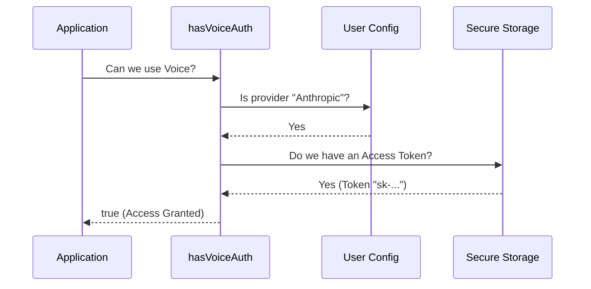

# Chapter 3: Provider-Specific Authentication

In the previous chapter, [Remote Feature Gating (GrowthBook)](02_remote_feature_gating__growthbook_.md), we learned how to install a "Smart Fuse" to disable features remotely.

Now that we know the feature is safe to use, we face a different problem: **Does the user have the right key to open the door?**

## The Problem: Not All Keys Are the Same

Imagine you are trying to enter an exclusive VIP lounge. You reach into your pocket and pull out a gym membership card. The bouncer stops you. "Sorry," they say, "that card works at the gym, but it doesn't work here."

In our application, we support many AI providers (Anthropic, Google Vertex, Amazon Bedrock). However, the **Voice Mode** feature is very specific. It relies on a special technology called `voice_stream` which is **exclusively available** via `claude.ai`.

If a user tries to use Voice Mode while logged in with an Amazon Bedrock key, the system will fail. We need a way to filter out users who have the wrong "membership card" *before* they try to connect.

## The Solution: The Bouncer

We use a concept called **Provider-Specific Authentication**. This is a strict check that ensures:
1.  The user is using the correct provider (Anthropic).
2.  The user has the specific type of credential required (OAuth Token).

We wrap this logic in a function called `hasVoiceAuth()`.

### How to Use It

As a developer, you use this function to decide if the user is "logged in" for Voice purposes.

```typescript
import { hasVoiceAuth } from './voiceModeEnabled';

// Simple check: Do they have the specific VIP card?
if (hasVoiceAuth()) {
  console.log("Allowed: User has Anthropic OAuth tokens.");
  enableMicrophone();
} else {
  console.log("Denied: User might be logged out OR using Bedrock/Vertex.");
}
```

**What happens here:**
*   **Input:** None (it checks the global authentication state).
*   **Output:** `true` only if the user is logged into `claude.ai` via OAuth.
*   **Result:** Users with API Keys, Bedrock keys, or no keys are filtered out.

---

## How it Works: Under the Hood

The `hasVoiceAuth` function performs a two-step verification process. Think of it like a bouncer checking an ID.

1.  **Check the Card Type:** Is the user currently set to use Anthropic? (If they are set to Google Vertex, stop immediately).
2.  **Check the Validity:** Does the user actually have a token in their keychain?

Here is the flow:



---

## Deep Dive: The Code

Let's break down the implementation in `voiceModeEnabled.ts`.

### Step 1: Filtering the Provider

First, we check if the user is even looking at the right provider. Standard API keys or other cloud providers (like Azure or Bedrock) do not support the `voice_stream` endpoint.

```typescript
export function hasVoiceAuth(): boolean {
  // 1. Check provider type.
  // Voice works ONLY with Anthropic OAuth.
  // API Keys, Bedrock, and Vertex are strictly forbidden here.
  if (!isAnthropicAuthEnabled()) {
    return false
  }
  
  // ... continued below
```

**Explanation:**
*   `isAnthropicAuthEnabled()`: Checks the user's settings. If they are configured for Amazon Bedrock, this returns `false`, and `hasVoiceAuth` immediately says "No".

### Step 2: Verifying the Token

If the provider is correct, we need to make sure the user is actually logged in. We look for the "Access Token" (the digital key).

```typescript
  // ... continued from above

  // 2. Retrieve the tokens from secure storage.
  const tokens = getClaudeAIOAuthTokens()
  
  // 3. Convert to boolean (true if token exists, false if null/empty).
  return Boolean(tokens?.accessToken)
}
```

**Explanation:**
*   `getClaudeAIOAuthTokens()`: This fetches the credentials from the computer's secure password storage (Keychain on macOS, Credentials Manager on Windows).
*   `Boolean(tokens?.accessToken)`: This is a fancy way of saying: "Is there text inside the token variable?" If it is undefined or empty, it returns `false`.

## A Note on Performance

You might wonder: *doesn't reading from the secure keychain take time?*

Yes, it does! On some computers, asking for a password takes 20-50 milliseconds. That is fast for a human, but slow for a computer trying to render a button 60 times a second.

If we ran this check every single frame, the app would stutter. We need a way to make this check faster. We will solve this in the next chapter using caching strategies.

## Conclusion

You have learned about **Provider-Specific Authentication**.

*   We don't just ask "Is the user logged in?"
*   We ask "Is the user logged in with **Anthropic OAuth**?"
*   This prevents bugs where the app tries to send voice data to incompatible providers (like Bedrock or Vertex).

This completes our "Readiness Logic." We have a fuse (GrowthBook) and a bouncer (Auth). But our bouncer is currently a bit slow at checking IDs.

In the next chapter, we will learn how to speed up this process so our UI stays buttery smooth.

[Next Chapter: Performance-Aware Token Access](04_performance_aware_token_access.md)

---

Generated by [Code IQ](https://github.com/adityasoni99/Code-IQ)