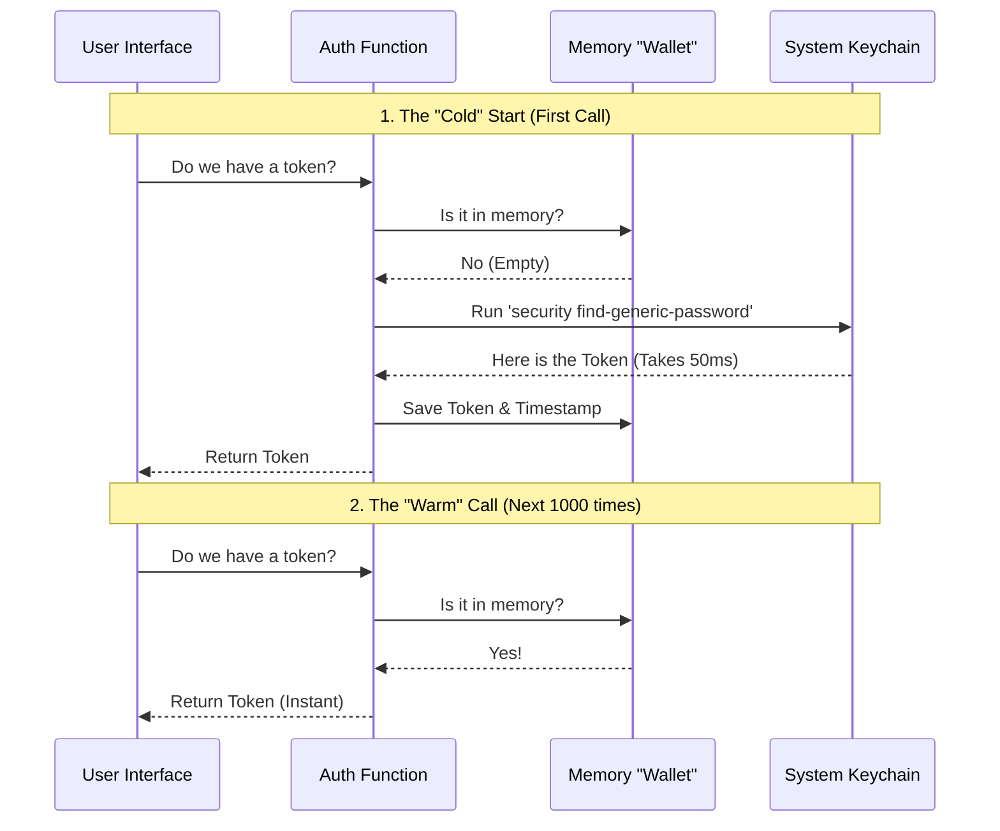

# Chapter 4: Performance-Aware Token Access

In the previous chapter, [Provider-Specific Authentication](03_provider_specific_authentication.md), we built a "Bouncer" function called `hasVoiceAuth()`. It checks the user's secure keychain to see if they have the right credentials.

However, we have a problem. The Bouncer is thorough, but he is **slow**.

## The Problem: The Heavy Vault Door

Reading a password from your computer's secure storage (like the macOS Keychain) is not like reading a variable from memory.

1.  The app has to pause.
2.  It asks the Operating System for permission.
3.  The OS spawns a separate process (e.g., the `security` command).
4.  The OS decrypts the data and hands it back.

This process takes about **20 to 50 milliseconds**.

### Why is 50ms a problem?
If you are running a command-line script once, 50ms is fine. But a User Interface (UI) redraws itself **60 times per second** (every 16ms).

If your UI asks, "Do we have the token?" every time it redraws, and the answer takes 50ms, your application will freeze, stutter, and feel broken.

## The Solution: "Check Once, Remember for an Hour"

We solve this using a strategy called **Memoization** (or Caching).

Think of it like a heavy steel vault.
*   **Without Memoization:** Every time you need to buy a coffee, you spin the dial, heave open the steel door, take out a coin, and close the door. (Slow).
*   **With Memoization:** You open the vault **once** in the morning, take out enough cash for the day, and put it in your wallet. For the rest of the day, you just check your wallet. (Fast).

In our code, the "Wallet" is a simple variable in memory.

## How to Use It

As a developer using our internal tools, you don't need to write the caching logic yourself. You simply call the token getter function.

We have designed `getClaudeAIOAuthTokens()` to handle the "Wallet" logic automatically.

```typescript
import { getClaudeAIOAuthTokens } from '../utils/auth';

// 1. First call: Opens the "Vault". Takes ~50ms.
const token1 = getClaudeAIOAuthTokens(); 

// 2. Second call: Checks the "Wallet". Takes ~0ms (Instant).
const token2 = getClaudeAIOAuthTokens();

// 3. The UI remains smooth!
```

**What happens here:**
*   **Input:** None.
*   **Output:** The OAuth token object.
*   **Performance:** The first time your app loads, there might be a tiny noticeable pause. Every check after that is instantaneous.

---

## How it Works: Under the Hood

Let's visualize the difference between the first call (Cold) and subsequent calls (Warm).

We use a variable in memory to store the result. We also set a timer (usually 1 hour) because security tokens eventually expire.



---

## Deep Dive: The Code

Let's look at how we implement this pattern in our `utils/auth.ts` file. We use a simplified version of the **Memoization Pattern**.

### 1. The Storage Variables

We define variables *outside* of the function. These act as our "Wallet." They stay in memory as long as the app is running.

```typescript
// These live outside the function scope
let cachedTokens: AuthTokens | null = null;
let lastFetchTime = 0;

// The "Wallet" is valid for 1 hour (3600000 ms)
const CACHE_DURATION = 3600 * 1000; 
```

### 2. The Smart Function

The function logic decides whether to use the cache or the slow keychain.

```typescript
export function getClaudeAIOAuthTokens() {
  const now = Date.now();

  // CHECK 1: Do we have data?
  // CHECK 2: Is the data fresh (less than 1 hour old)?
  if (cachedTokens && (now - lastFetchTime < CACHE_DURATION)) {
    return cachedTokens; // ✅ FAST RETURN
  }

  // If not, we have to do the hard work...
  // ... continued below
```

**Explanation:**
*   It checks `cachedTokens`. If it's `null`, we must fetch.
*   It checks `now - lastFetchTime`. If it has been more than an hour, the data is "stale" (old), so we ignore it and fetch fresh data.

### 3. The "Heavy Lift" and Update

If the cache was empty or old, we perform the slow operation and update the cache.

```typescript
  // ... continued from above
  
  // ⚠️ SLOW OPERATION: Read from OS Keychain
  const freshTokens = readTokensFromKeychainSystem(); 

  // Update the "Wallet" for next time
  cachedTokens = freshTokens;
  lastFetchTime = now;

  return freshTokens;
}
```

**Explanation:**
*   `readTokensFromKeychainSystem()` represents the slow code that talks to the OS.
*   Crucially, we update `cachedTokens` immediately after reading. This ensures the *next* time this function is called (milliseconds later), it hits the cache.

## Conclusion

You have learned about **Performance-Aware Token Access**.

*   **The Problem:** Security is heavy. Accessing keychains slows down the UI.
*   **The Solution:** Memoization (Caching).
*   **The Result:** We can call `isVoiceModeEnabled()` inside our render loops without fear of freezing the application.

We now have a complete, secure, and fast system for checking if Voice Mode should be active. 

However, there is one final optimization. If we decide to disable Voice Mode completely for a specific version of the app (e.g., the Free version), we don't just want to hide the code—we want to delete it entirely to save space.

[Next Chapter: Build-Time Code Elimination](05_build_time_code_elimination.md)

---

Generated by [Code IQ](https://github.com/adityasoni99/Code-IQ)