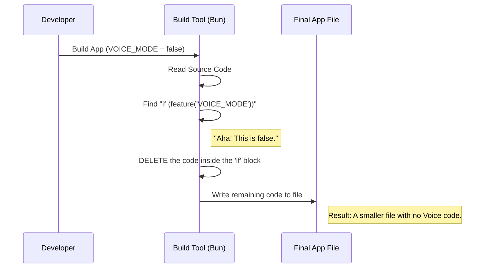

# Chapter 5: Build-Time Code Elimination

In the previous chapter, [Performance-Aware Token Access](04_performance_aware_token_access.md), we learned how to make our authentication checks fast using caching so the application doesn't stutter.

Now, we face a final challenge: **Weight**.

Even if a feature is disabled, the code for it usually sits inside the application file that users download. This makes the app larger and slower to download. In this final chapter, we will learn how to make that code completely vanish when it isn't needed.

## The Problem: The Overpacked Suitcase

Imagine you are packing a suitcase for a summer vacation to Hawaii. You have a heavy winter coat in your closet.

1.  **Runtime Check (What we usually do):** You pack the winter coat. When you arrive in Hawaii, you look at the weather, say "It's hot," and decide not to wear the coat. But you still had to carry it all the way there!
2.  **Build-Time Elimination (What we want to do):** You look at your itinerary *before* you leave your house. You realize you are going to Hawaii. You leave the coat in the closet. Your suitcase is lighter.

In software, "leaving the coat at home" is called **Dead Code Elimination** (or Tree Shaking).

## The Solution: The Compiler's Scissor

We use a special function provided by our build tool (Bun) called `feature`.

When we build the app, we tell the compiler: `VOICE_MODE = false`.
The compiler looks through our code. Everywhere it sees a check for that feature, it literally **deletes the code** inside that block before creating the final file.

### How to Use It

We wrap our logic in a check using `feature('FLAG_NAME')`.

```typescript
import { feature } from 'bun:bundle';

if (feature('VOICE_MODE')) {
  // This code only exists in the final app 
  // if we built it with VOICE_MODE turned on.
  console.log("Voice systems online.");
}
```

**What happens here:**
*   **If `VOICE_MODE` is true:** The code stays exactly as you wrote it.
*   **If `VOICE_MODE` is false:** The compiler deletes lines 3-6. The final app doesn't even know "Voice systems" existed.

---

## How it Works: Under the Hood

This process happens **before** the user ever downloads the app. It happens on your computer (or the build server) when you run the command to create the executable.

Let's visualize the "Tree Shaking" process. Imagine our code is a tree. The compiler shakes the tree, and any branch that is "dead" (disabled) falls off.



---

## Deep Dive: The Code

Let's look at `voiceModeEnabled.ts` one last time. We use this technique in our GrowthBook check.

### The "Ternary" Pattern

We use a specific coding style here to ensure everything gets deleted properly.

```typescript
import { feature } from 'bun:bundle'

export function isVoiceGrowthBookEnabled(): boolean {
  // We use the ternary operator (? :)
  return feature('VOICE_MODE')
    ? !getFeatureValue_CACHED('tengu_amber_quartz_disabled', false)
    : false
}
```

**Why do we write it this way?**

If `feature('VOICE_MODE')` is **false**, the compiler sees this:

```typescript
// The compiler simplifies the code to just this:
return false;
```

Because the first part was false, the compiler knows the second part (checking `tengu_amber_quartz_disabled`) can **never happen**.

### The Vanishing Strings

This is powerful because it also removes **Strings**.

The string `'tengu_amber_quartz_disabled'` takes up space. If we use the code above and disable Voice Mode, that string is deleted from the final binary. Hackers won't even be able to find that text in the app's memory because it simply isn't there.

### Comparing Logic

Let's look at how this fits into the bigger picture we learned in [Composite Readiness Logic](01_composite_readiness_logic.md).

```typescript
// 1. If Build Flag is OFF -> Returns false immediately (Code deleted).
// 2. If Build Flag is ON -> Runs the function.
// 3. The function checks the Remote Kill Switch.
const isGo = isVoiceGrowthBookEnabled();
```

## Conclusion

Congratulations! You have completed the tutorial on the Voice project's readiness architecture.

Let's review what you have built:

1.  **[Composite Readiness Logic](01_composite_readiness_logic.md):** You created a single "Master Checklist" (`isVoiceModeEnabled`) so the UI doesn't have to guess.
2.  **[Remote Feature Gating](02_remote_feature_gating__growthbook_.md):** You added a "Kill Switch" so we can disable the feature remotely if it breaks.
3.  **[Provider-Specific Authentication](03_provider_specific_authentication.md):** You added a "Bouncer" to ensure only users with Anthropic keys can enter.
4.  **[Performance-Aware Token Access](04_performance_aware_token_access.md):** You taught the Bouncer to remember IDs (Caching) so the app stays fast.
5.  **Build-Time Code Elimination:** You learned how to leave the heavy coat at home, making the app smaller and more secure when the feature isn't needed.

You now have a robust, secure, fast, and lightweight system for managing features. Happy coding!

---

Generated by [Code IQ](https://github.com/adityasoni99/Code-IQ)