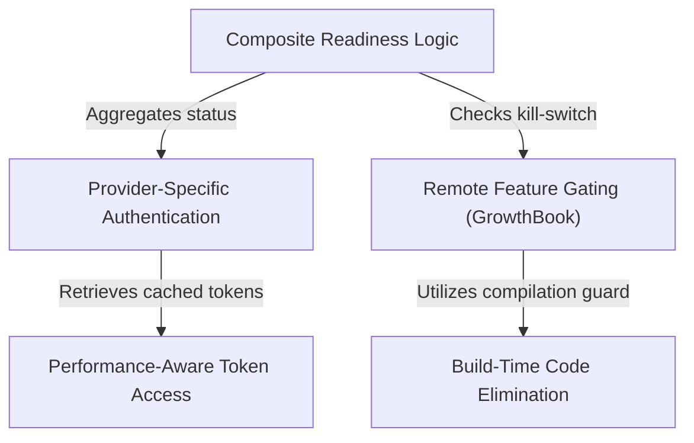

# Tutorial: voice

This project manages the activation logic for a **Voice Mode** feature within an AI application. It acts as a strict gatekeeper, combining *provider-specific authentication* checks with remote **feature flags** to safely determine if the voice interface should be enabled. To ensure speed and efficiency, it uses smart caching for security credentials and removes unused code during the build process.

## Chapters

1. [Composite Readiness Logic](01_composite_readiness_logic.md)
2. [Remote Feature Gating (GrowthBook)](02_remote_feature_gating__growthbook_.md)
3. [Provider-Specific Authentication](03_provider_specific_authentication.md)
4. [Performance-Aware Token Access](04_performance_aware_token_access.md)
5. [Build-Time Code Elimination](05_build_time_code_elimination.md)

---

Generated by [Code IQ](https://github.com/adityasoni99/Code-IQ)